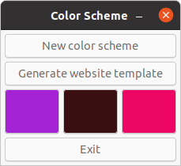
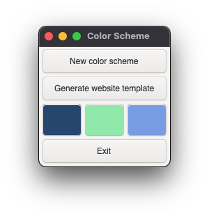
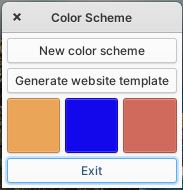
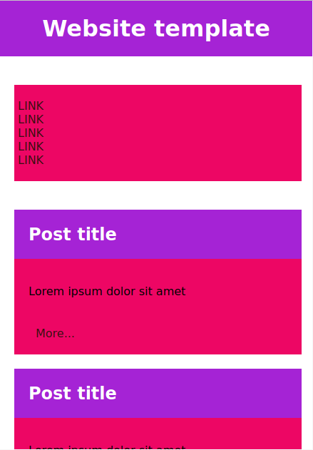
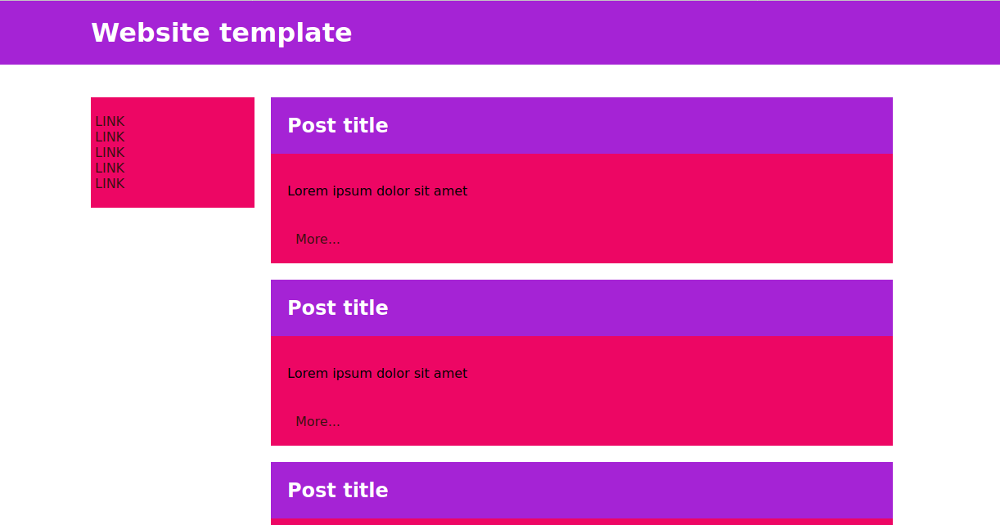

# Color Scheme
A small simple tool to generate color schemes for websites. The tool also offers generating a simple website using the generated colors. Application created for use with Linux distributions.
# How to run
## Install dependencies
### Debian/Ubuntu
Installing the system provided PyGObject
1. Open a terminal
2. Execute `sudo apt install python3-gi python3-gi-cairo gir1.2-gtk-3.0`

Installing from PyPI with pip:
1. Open a terminal and enter your virtual environment
2. Execute `sudo apt install libgirepository1.0-dev gcc libcairo2-dev pkg-config python3-dev gir1.2-gtk-3.0` to install the build dependencies and GTK
3. Execute `pip3 install pycairo` to build and install Pycairo
4. Execute `pip3 install PyGObject` to build and install PyGObject

### macOS
Installing PyGObject using brew
1. Open a terminal app
2. Execute `brew install pygobject3` to install PyGObject

Installing Gtk 3 using brew
1. Open a terminal app
2. Execute `brew install gtk+3` to install Gtk 3

## Start app
1. Enter into app directory
2. Execute `python3 main.py` to start Color Scheme app

## Screenshots
Ubuntu 20.04 Focal Fossa - Yaru

macOS Big Sur 11.5.1

elementary OS 6 Odin
### User interface

### Responsive website template
#### Mobile

#### Desktop

### Note
Notifications are not available on macOS as it is not using `systemd`. To use `dbus` communication you will need to be running X11 session.